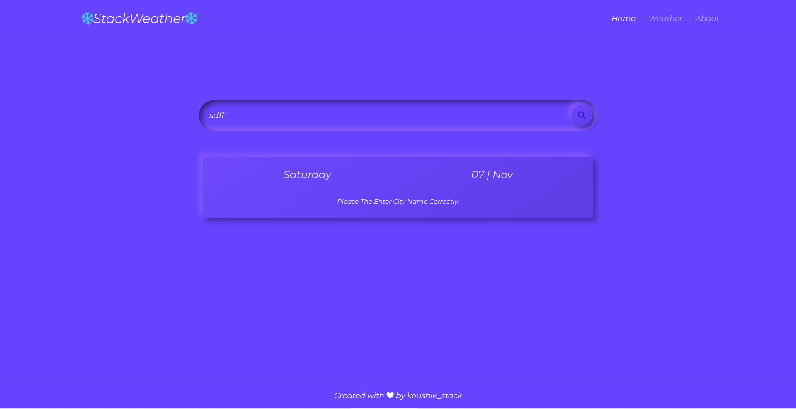

# Weather App 

Doing this project mainly for study purpose. This is a simple live weather app that shows you the temperature in your city.

## Software used:
 * WebStorm Edition 2020.1.2

## Language used:
 * Javascript(Nodejs,ExpressJs)

## Dependencies used:
 * express
 * hbs
 * scss(css preprocessor)
 
 ## Screenshots from the Browser
 
 ## Home Page 
 
 
 ## Weather Page
 
 
 
 
 
  ## Weather Page
 
 
  ## Mobile View
          
 
